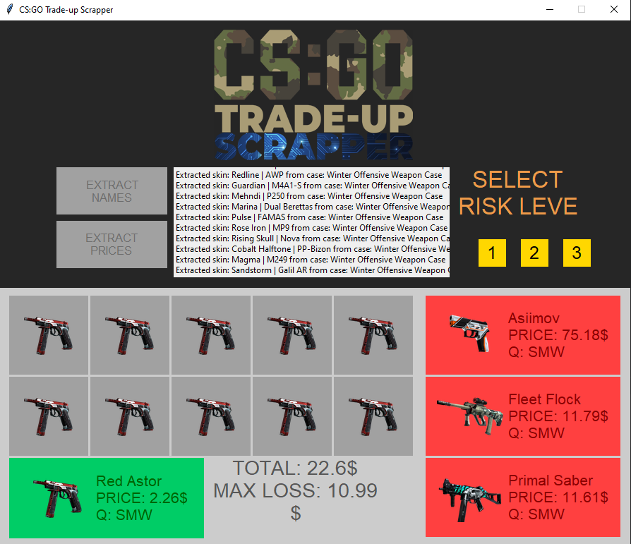

# CSGO Trade-Up Scrapper

This is my final project for an extracurricular Python course offered by Google that I enrolled in during my second year of university.

I have developed a program that updates a list of all possible skins in the game CS:GO and then searches for their selling prices on five specialized websites.

The ultimate goal of this research is to find a combination of ten skins that can be used in a trade-up contract in exchange for a higher-value skin, surpassing the total value of the ten individual skins. The objective is to discover an infinite source of profit, even if it is relatively modest. For more detailed information, please refer to the file [Prezentare_Scrapper.pdf](Prezentare_Scrapper.pdf).